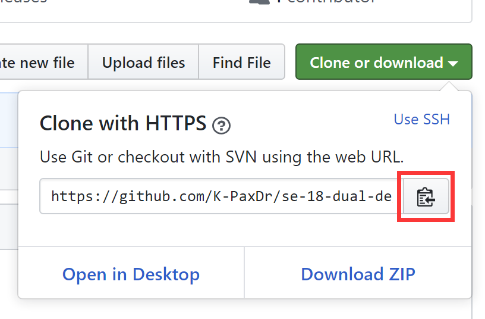
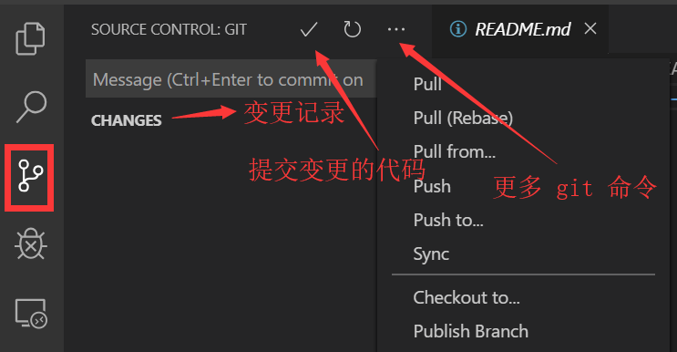

# VSCode git 使用指南

## 环境配置

下载 vscode，安装之。

下载 git 。

https://npm.taobao.org/mirrors/git-for-windows

选择合适的版本，在安装过程中，使用 vscode 作为默认编辑器。


打开 github.com 网站，注册用户。

注册完成之后，在右上角的头像上点击，选择 settings，将 public profile 中的 Name 改写为：学号+真实姓名。

打开文件管理器，新建你的项目文件夹 xxx。

打开 vscode，将 xxx 文件夹拖入 vscode，ctrl+shift+~ 打开终端，敲入如下命令进行 git 配置：

```shell
git config --global user.name "你注册 github 使用的用户名" 
git config --global user.email "你注册 github 使用的邮件地址"
```

## 术语

- repositories

  仓库。可建多个。

- projects

  项目。一个仓库下面可以多个项目。

- terminal

  终端。特指命令提示符窗口，分为 command/powershell 两种。
  
- branch

  分支。一个仓库有一个默认的分支 master，也可以建立不同的分支。

- HEAD

  文件的当前版本叫做 HEAD。

  HEAD^ 上一个版本，HEAD^^ 上上一个版本，HEAD~100 上一百个版本。

- stage

  暂存区，相对应的持久区就是 branch，关系如下：

  

## git 命令

命令这一块并不是特别重要了，不管是 github 还是 vscode 等工具，都已经将命令进行菜单化了，但学习命令的目的主要是为了搞清楚各个术语的含义，不了解这个 github 用不好。

- clone 仓库地址

  克隆仓库，将 github 已经建设好的仓库克隆到本地。

- add 文件

  添加文件到仓库。

- rm 文件

  删除文件。

- commit -m '提交消息'

  提交变更。

## 开始工作

克隆在 github 上建立好的仓库。

打开 github，转到你的仓库，复制仓库地址：



在刚才的 vscode 终端窗口中，输入：

```shell
git clone 刚才复制的地址
```

点击左侧的 Source Control 图标，即可打开源码控制（采用 GIT）器。



一般情况下，任何变更点击 "√" 就可以了。

